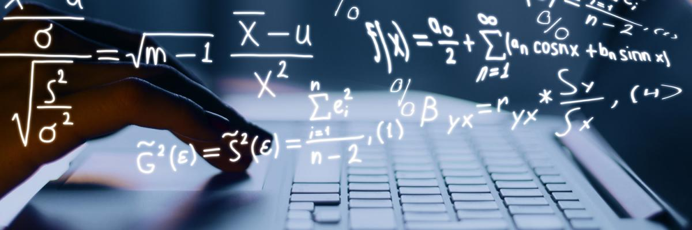

# Herramientas computacionales para modelado matemático
Notas, Notebooks y Material para un curso de Modelado Matemático

## Temario:
| Tema | Contenido | Observaciones | --- |
| --- | --- | --- | --- |
| 1. Representanción de números, Errores | --- | --- | --- |
| 2. Errores, buenas prácticas de programación y depuración | --- | --- | --- |
| 3. Álgebra lineal y sistemas de ecuaciones lineales | --- | --- | --- |
| 4. Autovalores y autovectores | --- | --- | --- |
| 5. Interpolación | --- | --- | --- |
| 6. Series | --- | --- | --- |
| 7. Raíces de ecuaciones | --- | --- | --- |
| 8. Diferenciación numérica | --- | --- | --- |
| 9. Integración numérica | --- | 2021.09.20 | [Integracon_numerica](../Notebooks/Integracion_numerica.ipynb) |
| 10. ODE's con problemas de valor inicial | --- | --- | --- |
| 11. ODE`s con problemas de frontera | --- | --- | --- |
| 12. Transformadas de Fourier y otras | --- | --- | --- |
| 13. Least Square metodos y Ajuste de curvas | --- | --- | --- |
| 14. Pragramación Orientada a Objetos | --- | --- | --- |
| 15. Paraleliza tu código Python | --- | --- | --- |
| 16. Visualización y gráficas | --- | --- | --- |
| --- | --- | --- | --- |
